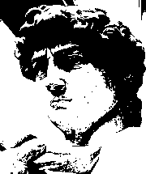
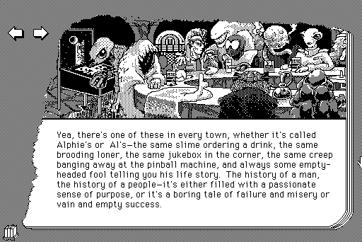

# Gammel datagrafikk og dithering

Se for deg at du har en skjerm som kun kan vise svarte og hvite piksler, det vil si enten _helt svart_ eller _helt hvit_, og du vil vise et bilde, for eksempel et nydelig bilde av Michelangeloskulpturen "David"? Problemet ditt er at bildet du vil vise har et helt spekter av forskjellige piksler, men skjermen krever at hver piksel begrenses til å ha en av de to verdiene. Hvordan viser du det vakre, detaljerte bildet på denne rare skjermen?

Én mulighet er å "runde av" pikslene. Om du gir alle pikslene en verdi mellom 0 (Helt svart) og 255 (Helt hvit), kan du sette en grense, for eksempel halvveis, og sette alle pikslene under denne verdien til svart, og alle over til hvit. Da blir bildet slik:

Æsj, det ser helt forferdelig ut! Heldigvis finnes det bedre måter å gjøre det på. Én av dem er _Floyd-Steinberg dithering_. Dette er en teknikk som går ut på å "spre" feilen utover. Hvis et felt av piksler ligger på akkurat midpunktet mellom svart og hvitt, gir det vel mer mening at annenhver piksel blir svart og hvit enn at alle skal bli til samme farge? Resultatet av prosessen er dette:

Sykt! Dette trikset ble blant annet brukt i gamle dataprogrammer for å gi en illusjon av flere lysverdier, et eksempel ser du her:

# Challenge: Implementer Floyd-Steinberg dithering

Du finner en implementasjon av "avrundigsmetoden" [i denne python-filen](threshold.py) som viser hvordan vi kan lese av og redigere piksler. Prøv å implentere FS i stedet for å få freshere bilder ;)

Algoritmen finner du [på FS-siden på Wikipedia](https://en.wikipedia.org/wiki/Floyd%E2%80%93Steinberg_dithering)

Om du vil lese mer om dithering, og se flere metoder, les [Wikipedia-siden om dithering](https://en.wikipedia.org/wiki/Dither)