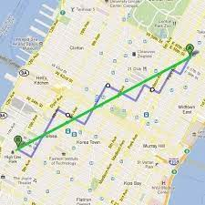
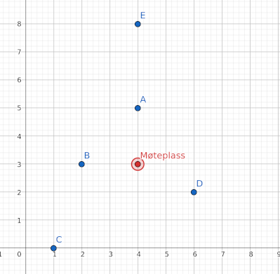

# Kaos i Manhattan

Du er på tur med vennegjengen i Manhattan. Plutselig blir dere angrepet av noen gærninger på gata og ender opp med å løpe hver deres retning. Etter mye løping innser du at du har unnsluppet gærningene, men du er sliten og hele gruppen er splittet. Heldigvis har dere Maps og kan se hvor dere er. Alle i gjengen sender koordinatene sine i gruppechatten, men nå kommer spørsmålet: Hvor skal dere møtes?

Koordinatene i gruppa er gitt som tupler, feks `(3,10)`. Alle koordinatene er gitt med heltall og tilsvarer gatekryss. Avstanden mellom to gatekryss `(a, b)` og `(c, d)` er lik `(abs(a-c), abs(b-c))` fordi man ikke kan krysse bygningene i Manhattan.



Du er ikke den eneste som er sliten, og alle vil gjerne gå minst mulig. Finn koordinatene på gatekrysset som krever at dere må gå minst til sammen.

Husk at alle gatekryss har heltall-koordinater.

## Finn gatekrysset som krever minst total lengde

Lag en funksjon `groupMeet(coords)` som tar inn en liste av tupler (koordinater) og returnerer koordinatene på det beste gatekrysset å møtes på. Dersom det er flere som deler førsteplassen er det ikke så farlig hvilken dere returnerer.

Eks:

```python
>>> groupMeet([(1, 0), (2, 0), (3, 0)])
(2, 0) # Møtes på midten
>>> groupMeet([(4, 5),(2, 3),(1, 0),(6, 2),(4, 8)])
(4, 3) # Som på bildet under
```
