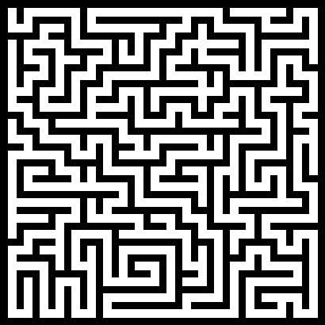

# Generer labyrinter

Det finnes flere kule algoritmer for å generere labyrinter. Den enkleste er kanskje ["Randomized depth-first search"](https://en.wikipedia.org/wiki/Maze_generation_algorithm#Randomized_depth-first_search). Da får du labyrinter som ser litt sånn ut:

## Challenge: Implementer ["Randomized depth-first search"](https://en.wikipedia.org/wiki/Maze_generation_algorithm#Randomized_depth-first_search)

I [walls.py](walls.py) har vi litt eksempelkode som kan være til hjelp hvis dere vil tegne en labyrint lik bildet.

Hvis dere vil, kan dere prøve å implementere flere forskjellige algoritmer fra [Wikipedia-siden](https://en.wikipedia.org/wiki/Maze_generation_algorithm)